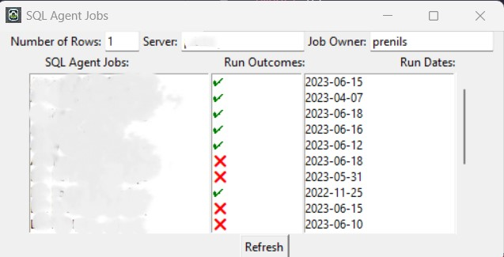

# SQLJobHealth

This is a tkinter application which takes your windowns login name, appends it to a hardcoded domain name for your oranisation and uses that combination to log into a hardcoded SQL Server using Windows authentication.

It will create a GUI which displays all MS SQL Server jobs owned by the user, their most recent run and an icon representing the outcome of the run. 

There is a input box on the top right which will change the number of most recent runs to display for each job. The default is 1.


# Using
## Optional
Create a virtual environment using the requirement.txt file in the repos root.

You can change the 'server' value in config.json and add an item called 'job_owner' if you want to. But if not, when you first start the application it will give you an error and you will then have the chance to change the values in the entry boxes. Once you press refresh, they will be saved to your config file.

## Package
You can package it into an application using the following code in the root of your directory from a terminal
```shell
python -m PyInstaller SQLJobHealth.spec
